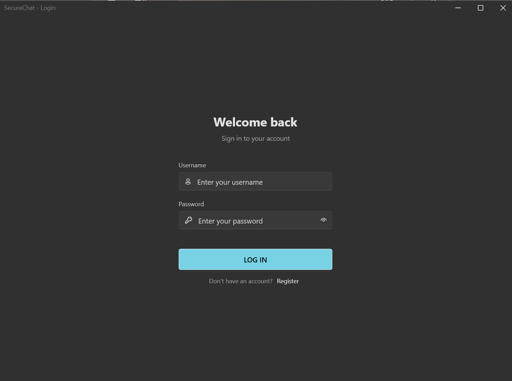
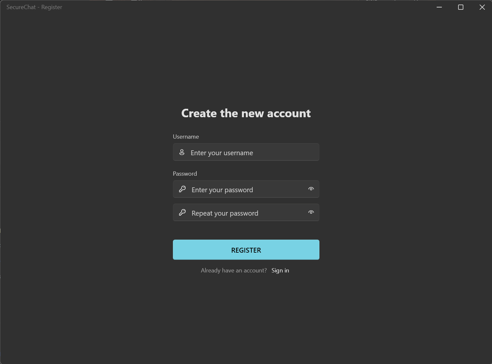
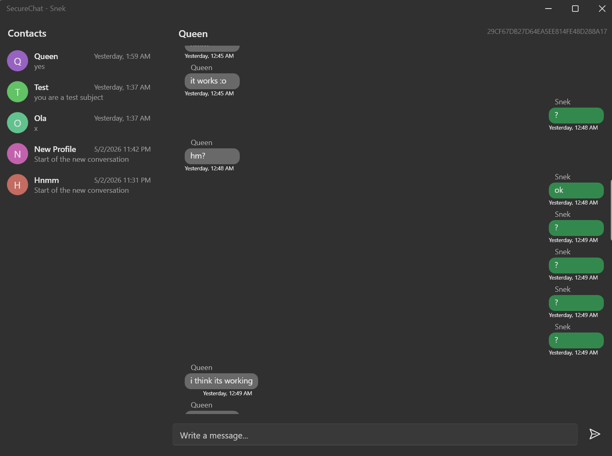

# SecureChat

A desktop chat application built with WPF and .NET 9, focused on keeping messages private. The server never has access to plaintext messages, everything is encrypted on the client before being sent, and stored encrypted in the database.

### Login


### Registration


### Chat


## How the security works

### End-to-end encryption

When you register, the client generates an ECDH key pair (NIST P-256 curve) locally. The private key never leaves your machine. The public key gets uploaded to the server so other users can use it to establish a shared secret with you.

When you send a message, the client:
1. Fetches the recipient's public key
2. Uses ECDH to derive a shared secret from your private key and their public key
3. Encrypts the message with AES-GCM using that shared secret
4. Sends the ciphertext to the server

The recipient does the same in reverse — they combine their private key with your public key and get the same shared secret, which lets them decrypt the message. The server at no point can do this, because it doesn't have anyone's private key.

### Encryption at rest

Even though the server can't read message content, it still stores the ciphertext in the database. On top of that, all data in the database, usernames, public keys, and message content, is encrypted again with AES-GCM using a server-side key stored in environment variables. So a raw database dump gives you nothing useful.

Usernames are also stored as HMAC-SHA256 hashes separately, which is how the server checks username availability and handles login lookups without having to decrypt anything.

### Passwords

Passwords are hashed on client and then encrypted with BCrypt on the server. The server stores only the BCrypt hash, never the original password hash.

### Authentication

After login or registration, the server issues a short-lived JWT (5 minutes). The client uses this token to authenticate all subsequent requests.

## Tech stack

| Part | Technology |
|---|---|
| Client | WPF, .NET 9 |
| Server | ASP.NET Core, .NET 9 |
| Database | PostgreSQL + Entity Framework Core |
| Real-time | SignalR |
| UI components | WPF UI |
| Encryption | ECDH P-256, AES-GCM, HMAC-SHA256, BCrypt |

## Running the project

### Requirements

- .NET 9 SDK
- PostgreSQL

### 1. Set up environment variables

The server won't start without these. You need to set up .env file before running anything:

```
DB_HOST=
DB_NAME=
DB_USER=
DB_PASSWORD=

AES_KEY=
HMAC_KEY=
JWT_KEY=
```

### 2. Run database migrations

```bash
dotnet ef database update --project SecureChat.Server
```

### 3. Start the server

```bash
dotnet run --project SecureChat.Server
```

The server listens on `http://localhost:5000`. The client has this address hardcoded, so it needs to stay on that port.

### 4. Start the client

```bash
dotnet run --project SecureChat.Client
```

Or open the solution in Visual Studio and run `SecureChat.Client` directly. Make sure the server is already running before you try to log in or register.
